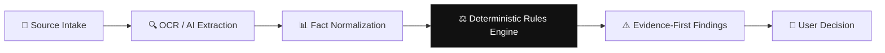

<div align="center">

# 🛡️ ALCATRAZ AI

### *"Verify before you act."*

**Privacy-first, on-device AI verification and contradiction-detection system for Windows PCs.**

[](https://github.com/aryannlodha/alcatraz-ai/actions)
[](https://opensource.org/licenses/MIT)
[](https://www.typescriptlang.org/)
[](https://www.qualcomm.com/)

</div>

---

## 🎯 Problem Statement

Every day, people submit applications, authorize payments, and click links **without cross-checking the information in front of them**. A graduation year on a resume doesn't match the application form. An invoice account number differs from the payment screen. A phishing email's sender domain doesn't match the company it claims to represent.

**These mistakes are preventable.** But current AI tools either generate answers (chatbots) or auto-fill forms (copilots) — none of them *verify* before the user acts.

## 💡 Solution

Alcatraz AI is a **verification layer**, not an assistant. It accepts multiple independent digital sources, extracts structured facts, normalizes them, cross-checks them using **deterministic rules**, and presents evidence-backed warnings before a user submits, sends, pays, or acts.

> **AI extracts. Rules compare. You decide.**

### Core Principle
- ✅ AI models extract and interpret information from documents
- ✅ **Deterministic code** compares facts and evaluates rules (zero hallucination)
- ✅ The user makes every consequential decision
- ❌ Never claims fraud with certainty — uses "potential risk" or "mismatch detected"
- ❌ Never submits forms, sends emails, or makes payments
- ❌ Never uploads data without explicit user consent

---

## 🏗️ Architecture



| Layer | Technology | Purpose |
|-------|-----------|---------|
| **Frontend** | React 19 + Vite + Tailwind CSS | Responsive desktop UI with dark mode |
| **Desktop Shell** | Tauri 2.0 (Rust) | Native Windows app wrapper |
| **Contracts** | Zod schemas | Type-safe Fact/Finding/Source definitions |
| **Reasoning** | TypeScript rules engine | Normalizers, comparators, scenario rules |
| **OCR** | Tesseract.js | On-device image-to-text extraction |
| **PDF** | PDF.js | Local PDF text layer extraction |
| **AI Runtime** | ONNX Runtime | Snapdragon NPU-ready local inference |
| **Testing** | Vitest | 29+ unit and integration tests |

---

## ✨ Features

### Verification Scenarios
| Scenario | Inputs | What It Checks |
|----------|--------|----------------|
| 📋 **Application Consistency** | Resume + Application + Job Description | Names, graduation years, eligibility, skills |
| 💳 **Invoice/Payment Check** | Invoice PDF + Payment Screen | Account numbers, amounts, vendor names |
| 📧 **Email/Phishing Risk** | Suspicious email content | Sender domain vs claimed domain, urgency, credential requests |

### Product Features
- 🌙 **Dark Mode** — System-aware with manual toggle
- 📊 **Fact Relationship Graph** — Interactive SVG visualization of extracted facts
- 📥 **Drag & Drop Upload** — PDF, PNG, JPG, TXT (10MB limit)
- 📋 **Clipboard Paste** — Quick text analysis for emails and web content
- 📄 **Export HTML Reports** — Professional branded reports with findings
- 📜 **Analysis History** — localStorage-persisted past analyses
- ⌨️ **Keyboard Shortcuts** — `Ctrl+U`, `Ctrl+1/2/3`, `?` for help
- 🔔 **Toast Notifications** — Real-time feedback system
- 🎓 **Onboarding Flow** — First-run explainer carousel
- 📖 **How It Works** — In-app architecture walkthrough
- 🔒 **Privacy Policy** — Transparent data handling documentation
- 🟢 **Privacy Badge** — Real-time indicator: "Local / On-Device (Privacy Safe)"
- 📱 **PWA Ready** — Installable from browser, works offline

---

## 🚀 Quick Start

### Prerequisites
- Node.js ≥ 20
- pnpm ≥ 9

### Setup
```bash
git clone https://github.com/aryannlodha/alcatraz-ai.git
cd alcatraz-ai
pnpm install
```

### Development
```bash
# Run the desktop app in browser
cd apps/desktop
pnpm dev
```

### Build
```bash
# Build all packages
cd packages/contracts && pnpm exec tsc
cd ../reasoning && pnpm exec tsc
cd ../../apps/desktop && pnpm run build
```

### Test
```bash
cd tests
pnpm exec vitest run
```

---

## 📁 Project Structure

```
alcatraz-ai/
├── apps/
│   └── desktop/          # React + Vite + Tailwind desktop app
│       ├── src/
│       │   ├── components/   # AppShell, FindingCard, FactGraph, Toast, etc.
│       │   ├── pages/        # Dashboard, Analyze, Upload, Paste, Settings, etc.
│       │   ├── hooks/        # useKeyboardShortcuts
│       │   └── utils/        # history
│       └── src-tauri/        # Rust native shell (Tauri 2.0)
├── packages/
│   ├── contracts/        # Zod schemas (Fact, Finding, Source, Evidence)
│   └── reasoning/        # Deterministic rules engine
│       ├── normalizers.ts    # Date, name, number, account, domain, email
│       ├── comparators.ts    # Exact, fuzzy (Fuse.js), account comparison
│       └── rules.ts          # 10 scenario rules across 3 categories
├── services/
│   └── analysis/         # Pipeline: Source → OCR → Facts → Findings
│       └── providers/
│           ├── RegexProvider.ts   # Pattern-based fact extraction
│           └── ONNXProvider.ts    # Snapdragon NPU-ready AI inference
├── demo/                 # Synthetic test data
├── tests/                # Vitest unit + integration tests
└── .github/workflows/    # CI pipeline
```

---

## 🔬 Snapdragon Integration

Alcatraz AI is designed and optimized for **Snapdragon-powered HP PCs**:

- **ONNX Runtime** with QNN Execution Provider support for NPU acceleration
- **Tesseract.js** runs OCR entirely on-device (CPU/NPU)
- **Zero cloud dependency** — all processing defaults to local hardware
- **Benchmarks page** ready for NPU vs CPU performance comparison
- Architecture follows Qualcomm AI Hub patterns for model deployment

---

## 🧪 Testing

```
29+ tests across 4 test files:
├── unit/normalizers.test.ts    — Date, account, domain, name, number normalizers
├── unit/comparators.test.ts    — Exact, fuzzy, account comparison logic
├── unit/rules.test.ts          — All 10 scenario rules
└── integration/demo.test.ts    — End-to-end synthetic scenario validation
```

---

## 🔒 Privacy Commitment

- All processing is **local by default**
- Uploaded files are held in browser memory only — never written to disk
- Raw files are garbage-collected after analysis
- History stores only structured facts, never raw documents
- Cloud fallback requires **explicit user opt-in** with a visible warning
- Fully open-source and auditable

---

## 📄 License

MIT License © 2026 Aryan Lodha

---

<div align="center">

**Built for the Qualcomm Snapdragon® AI Lab Build & Present Challenge 2026**

*Alcatraz AI — Because trust requires verification.*

</div>
